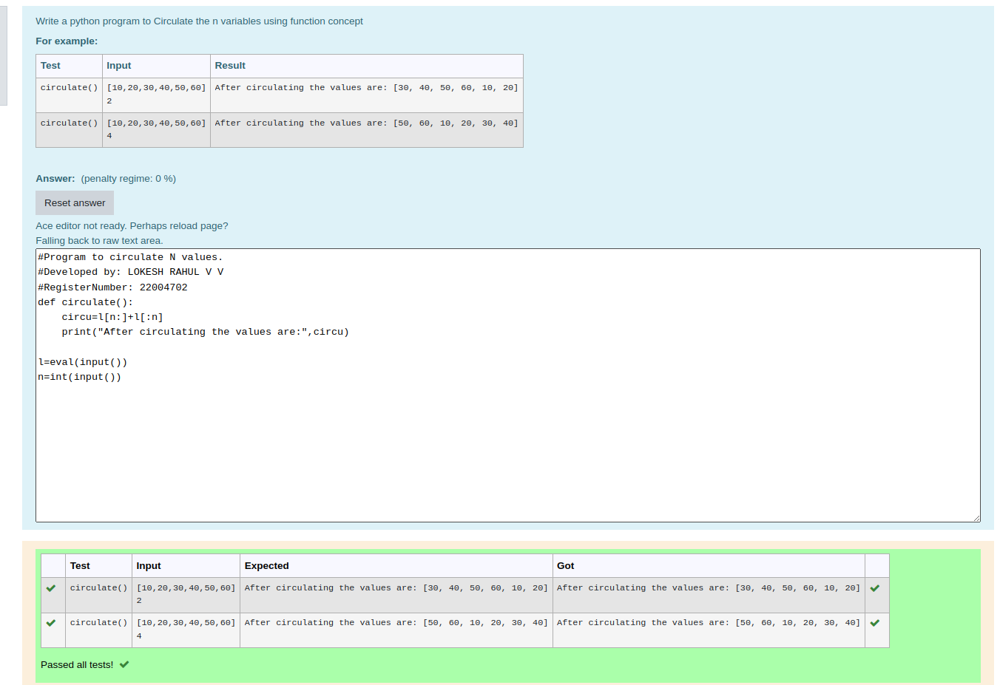

# Circulate-the-values-of-N-variables
## Aim:
To write a python program to circulate the n variables using function concept
## Equipment’s required:
PC
Anaconda - Python 3.7
## Algorithm: 
### Step 1: 
program to circulate n variables

### Step 2:
define the function

### Step 3: 
Get the value from the user for the number of rotation

### Step 4: 
Using the slicing concept rotate the list

### Step 5:
print the list

### Step 6: 
call the function
## Program:
```
#Program to circulate N values.
#Developed by: LOKESH RAHUL V V
#RegisterNumber: 22004702
def circulate():
    circu=l[n:]+l[:n]
    print("After circulating the values are:",circu)
    
l=eval(input())
n=int(input())
```
## Output:


## Result:
Thus,the experiment was executed successfully..
